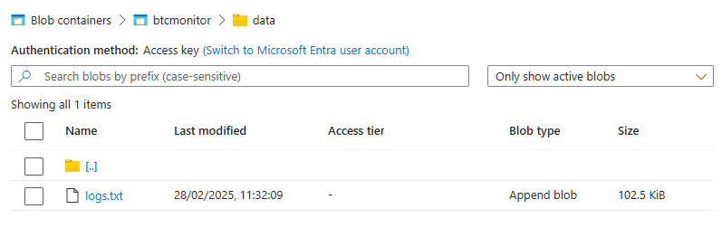
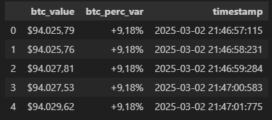

# BTCMonitor

## Descrição
Este simples projeto feito em python surgiu da vontade de obter dados e informações sobre criptomoedas e as armazenar de forma persistente para futura análise. Minha intenção não foi construir um sistema profissional para consumo desses dados; na verdade, existem diversas empresas que são especializadas na área e que exercem esse papel muito bem. Eu quis encontrar uma solução para coletar esses dados de uma maneira livre, sem depender de cadastros ou pagamentos. O fato é que a grande maioria dessas empresas, isto se não todas, oferecem planos gratuitos limitadíssimos para o acesso dos dados. Com isso em mente, criei um programa que coleta esses dados a partir de uma página web de forma automática e persiste tudo em um blob na nuvem Azure, gerando um registro histórico.

## Tecnologias Utilizadas
- Python
- Biblioteca Selenium
- Azure Blob Storage

## Connection String
A conection string do azure blob storage é obtida a partir da variável `AZURE_STORAGE_CONNECTION_STRING`.
Iremos defini-la mais abaixo.

## Setup

### Windows
```batch
git clone https://github.com/fernandomsant/btcmonitor.git

cd btcmonitor

REM Criando venv
python -m venv C:\Caminho\Para\Virtual\Environment

REM Ativando venv
call C:\Caminho\Para\Virtual\Environment\Scripts\activate.bat

REM Instalando dependências
pip install -r requirements.txt

setx AZURE_STORAGE_CONNECTION_STRING "sua-connection-string"

python main.py
```
### Linux
```sh
git clone https://github.com/fernandomsant/btcmonitor.git

cd btcmonitor

# Criando venv
python -m venv /Caminho/Para/Virtual/Environment

# Ativando venv
/Caminho/Para/Virtual/Environment/bin/activate

# Instalando dependências
pip install -r requirements.txt

export AZURE_STORAGE_CONNECTION_STRING=sua-connection-string

python main.py
```
<br>

Blob na azure
<br>


Preview dos dados
<br>

